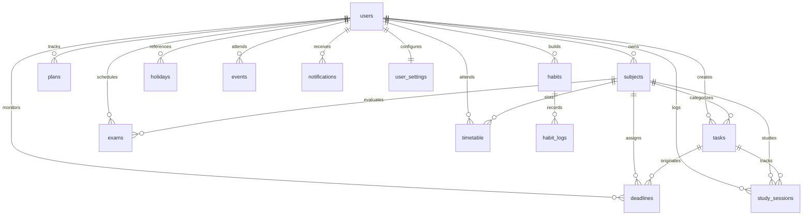

# Database Design Documentation

## Student Life Manager
### Personal Academic & Productivity Management System
**Database Engine:** MySQL 8.0+ / InnoDB / `utf8mb4`  
**Database Name:** `student_life_manager`  
**Management Tool:** MySQL Workbench

---

## 1. Entity-Relationship Overview

The database follows a normalized relational structure centered around the `users` entity. All application modules (tasks, subjects, timetable, exams, habits, study sessions, etc.) are user-scoped with referential integrity and cascading rules to ensure complete data isolation and consistency.

---

## 2. Table Schemas & Data Dictionary

### 2.1 `users`
Stores student accounts with BCrypt-hashed credentials.

| Column | Type | Constraints | Description |
|---|---|---|---|
| `id` | `INT` | `PRIMARY KEY`, `AUTO_INCREMENT` | Unique user identifier |
| `username` | `VARCHAR(50)` | `NOT NULL`, `UNIQUE` | Unique login username |
| `email` | `VARCHAR(100)` | `NOT NULL`, `UNIQUE` | Unique college email |
| `password_hash` | `VARCHAR(255)` | `NOT NULL` | BCrypt salted hash (60 chars) |
| `full_name` | `VARCHAR(100)` | `NOT NULL` | Student display name |
| `created_at` | `TIMESTAMP` | `DEFAULT CURRENT_TIMESTAMP` | Account registration time |
| `updated_at` | `TIMESTAMP` | `DEFAULT CURRENT_TIMESTAMP ON UPDATE CURRENT_TIMESTAMP` | Last profile update |

**Indexes:**
- `idx_users_username` on `username` (B-Tree, fast login lookup)
- `idx_users_email` on `email` (B-Tree, unique lookup)

---

### 2.2 `subjects`
Stores enrolled academic courses, professors, classrooms, and color tokens.

| Column | Type | Constraints | Description |
|---|---|---|---|
| `id` | `INT` | `PRIMARY KEY`, `AUTO_INCREMENT` | Course identifier |
| `user_id` | `INT` | `NOT NULL`, `FK -> users(id) ON DELETE CASCADE` | Owning student |
| `name` | `VARCHAR(100)` | `NOT NULL` | Course title (e.g., Computer Networks) |
| `course_code` | `VARCHAR(20)` | `NULL` | Code (e.g., CS302) |
| `faculty` | `VARCHAR(100)` | `NULL` | Professor / Instructor name |
| `room` | `VARCHAR(50)` | `NULL` | Lecture hall or lab number |
| `credits` | `INT` | `DEFAULT 3` | Credit weight |
| `color` | `VARCHAR(20)` | `DEFAULT '#4f46e5'` | Hex color badge |
| `created_at` | `TIMESTAMP` | `DEFAULT CURRENT_TIMESTAMP` | Creation timestamp |
| `updated_at` | `TIMESTAMP` | `DEFAULT CURRENT_TIMESTAMP ON UPDATE CURRENT_TIMESTAMP` | Last updated |

**Indexes:**
- `idx_subjects_user` on `user_id`

---

### 2.3 `tasks`
Core task repository supporting academic, assignment, project, and recurring workflows.

| Column | Type | Constraints | Description |
|---|---|---|---|
| `id` | `INT` | `PRIMARY KEY`, `AUTO_INCREMENT` | Task identifier |
| `user_id` | `INT` | `NOT NULL`, `FK -> users(id) ON DELETE CASCADE` | Owning student |
| `subject_id` | `INT` | `NULL`, `FK -> subjects(id) ON DELETE SET NULL` | Linked subject |
| `title` | `VARCHAR(200)` | `NOT NULL` | Actionable task headline |
| `description` | `TEXT` | `NULL` | Extended notes / deliverables |
| `category` | `VARCHAR(50)` | `NOT NULL DEFAULT 'Academic'` | Academic, Assignment, Lab, Project, Personal, Club, Other |
| `priority` | `VARCHAR(20)` | `NOT NULL DEFAULT 'MEDIUM'` | LOW, MEDIUM, HIGH, URGENT |
| `status` | `VARCHAR(20)` | `NOT NULL DEFAULT 'PENDING'` | PENDING, IN_PROGRESS, COMPLETED, CANCELLED |
| `due_date` | `DATE` | `NULL` | Target completion date |
| `due_time` | `TIME` | `NULL` | Target completion time |
| `estimated_minutes` | `INT` | `DEFAULT 30` | Expected effort |
| `actual_minutes` | `INT` | `DEFAULT 0` | Logged effort |
| `recurrence` | `VARCHAR(20)` | `DEFAULT 'NONE'` | NONE, DAILY, WEEKLY, MONTHLY |
| `completed_at` | `TIMESTAMP` | `NULL` | Date-time marked completed |
| `created_at` | `TIMESTAMP` | `DEFAULT CURRENT_TIMESTAMP` | Record creation timestamp |
| `updated_at` | `TIMESTAMP` | `DEFAULT CURRENT_TIMESTAMP ON UPDATE CURRENT_TIMESTAMP` | Record update timestamp |

**Indexes:**
- `idx_tasks_user` on `user_id`
- `idx_tasks_due_date` on `due_date`
- `idx_tasks_status` on `status`
- `idx_tasks_priority` on `priority`

---

### 2.4 `deadlines`
Strict deadline trackers with days remaining and urgency monitoring.

| Column | Type | Constraints | Description |
|---|---|---|---|
| `id` | `INT` | `PRIMARY KEY`, `AUTO_INCREMENT` | Deadline ID |
| `user_id` | `INT` | `NOT NULL`, `FK -> users(id) ON DELETE CASCADE` | Student ID |
| `subject_id` | `INT` | `NULL`, `FK -> subjects(id) ON DELETE SET NULL` | Linked Subject |
| `task_id` | `INT` | `NULL`, `FK -> tasks(id) ON DELETE SET NULL` | Associated Task |
| `title` | `VARCHAR(200)` | `NOT NULL` | Submission / milestone title |
| `due_date` | `DATE` | `NOT NULL` | Hard deadline date |
| `due_time` | `TIME` | `NULL` | Cutoff time |
| `priority` | `VARCHAR(20)` | `DEFAULT 'HIGH'` | LOW, MEDIUM, HIGH, URGENT |
| `status` | `VARCHAR(20)` | `DEFAULT 'PENDING'` | PENDING, COMPLETED |
| `created_at` | `TIMESTAMP` | `DEFAULT CURRENT_TIMESTAMP` | Created timestamp |

**Indexes:**
- `idx_deadlines_user` on `user_id`
- `idx_deadlines_date` on `due_date`

---

### 2.5 `exams`
Internal and semester examinations, syllabi, timings, and preparation percentages.

| Column | Type | Constraints | Description |
|---|---|---|---|
| `id` | `INT` | `PRIMARY KEY`, `AUTO_INCREMENT` | Exam identifier |
| `user_id` | `INT` | `NOT NULL`, `FK -> users(id) ON DELETE CASCADE` | Student ID |
| `subject_id` | `INT` | `NULL`, `FK -> subjects(id) ON DELETE SET NULL` | Evaluated Subject |
| `title` | `VARCHAR(200)` | `NOT NULL` | Exam Title |
| `exam_type` | `VARCHAR(50)` | `NOT NULL` | CAT-I, CAT-II, Internal Test, Lab Test, Model Exam, Semester Exam, Practical Exam, Viva |
| `exam_date` | `DATE` | `NOT NULL` | Date of examination |
| `start_time` | `TIME` | `NOT NULL` | Commencing time |
| `end_time` | `TIME` | `NOT NULL` | Concluding time |
| `venue` | `VARCHAR(100)` | `NULL` | Exam Hall / Lab location |
| `syllabus` | `TEXT` | `NULL` | Chapters and units covered |
| `preparation_percentage`| `INT` | `DEFAULT 0` | Readiness slider (0-100) |
| `notes` | `TEXT` | `NULL` | Focus areas and revision notes |
| `created_at` | `TIMESTAMP` | `DEFAULT CURRENT_TIMESTAMP` | Created timestamp |
| `updated_at` | `TIMESTAMP` | `DEFAULT CURRENT_TIMESTAMP ON UPDATE CURRENT_TIMESTAMP` | Updated timestamp |

**Indexes:**
- `idx_exams_user` on `user_id`
- `idx_exams_date` on `exam_date`

---

### 2.6 `timetable`
Weekly periodic class schedule (Monday through Sunday) for active timetable generation.

| Column | Type | Constraints | Description |
|---|---|---|---|
| `id` | `INT` | `PRIMARY KEY`, `AUTO_INCREMENT` | Timetable slot ID |
| `user_id` | `INT` | `NOT NULL`, `FK -> users(id) ON DELETE CASCADE` | Student ID |
| `subject_id` | `INT` | `NOT NULL`, `FK -> subjects(id) ON DELETE CASCADE` | Scheduled course |
| `day_of_week` | `VARCHAR(20)` | `NOT NULL` | Monday, Tuesday, Wednesday, Thursday, Friday, Saturday, Sunday |
| `start_time` | `TIME` | `NOT NULL` | Class start time |
| `end_time` | `TIME` | `NOT NULL` | Class end time |
| `room` | `VARCHAR(50)` | `NULL` | Class venue |
| `faculty` | `VARCHAR(100)` | `NULL` | Teacher |
| `created_at` | `TIMESTAMP` | `DEFAULT CURRENT_TIMESTAMP` | Created timestamp |

**Indexes:**
- `idx_timetable_user` on `user_id`
- `idx_timetable_day` on `day_of_week`

---

### 2.7 `plans`
Future long-term academic and career initiatives with milestones and progress tracking.

| Column | Type | Constraints | Description |
|---|---|---|---|
| `id` | `INT` | `PRIMARY KEY`, `AUTO_INCREMENT` | Plan ID |
| `user_id` | `INT` | `NOT NULL`, `FK -> users(id) ON DELETE CASCADE` | Student ID |
| `title` | `VARCHAR(200)` | `NOT NULL` | Goal title (e.g., Master DSA) |
| `description` | `TEXT` | `NULL` | Roadmap description |
| `start_date` | `DATE` | `NULL` | Target begin date |
| `target_date` | `DATE` | `NULL` | Target achievement date |
| `priority` | `VARCHAR(20)` | `DEFAULT 'MEDIUM'` | Priority level |
| `progress` | `INT` | `DEFAULT 0` | Progress completion % (0-100) |
| `status` | `VARCHAR(20)` | `DEFAULT 'PLANNED'` | PLANNED, ACTIVE, COMPLETED, PAUSED, CANCELLED |
| `created_at` | `TIMESTAMP` | `DEFAULT CURRENT_TIMESTAMP` | Created timestamp |
| `updated_at` | `TIMESTAMP` | `DEFAULT CURRENT_TIMESTAMP ON UPDATE CURRENT_TIMESTAMP` | Updated timestamp |

**Indexes:**
- `idx_plans_user` on `user_id`

---

### 2.8 `habits` & 2.9 `habit_logs`
Habit development system supporting daily streak calculations and monthly consistency logs.

**`habits` Table:**
| Column | Type | Constraints | Description |
|---|---|---|---|
| `id` | `INT` | `PRIMARY KEY`, `AUTO_INCREMENT` | Habit ID |
| `user_id` | `INT` | `NOT NULL`, `FK -> users(id) ON DELETE CASCADE` | Student ID |
| `name` | `VARCHAR(100)` | `NOT NULL` | Habit name (e.g., Coding, Reading) |
| `description` | `TEXT` | `NULL` | Routine notes |
| `category` | `VARCHAR(50)` | `DEFAULT 'General'` | Focus category |
| `target_frequency`| `VARCHAR(50)` | `DEFAULT 'DAILY'` | Recurrence |
| `color` | `VARCHAR(20)` | `DEFAULT '#10b981'` | Theme badge |
| `created_at` | `TIMESTAMP` | `DEFAULT CURRENT_TIMESTAMP` | Created timestamp |

**`habit_logs` Table:**
| Column | Type | Constraints | Description |
|---|---|---|---|
| `id` | `INT` | `PRIMARY KEY`, `AUTO_INCREMENT` | Log ID |
| `habit_id` | `INT` | `NOT NULL`, `FK -> habits(id) ON DELETE CASCADE` | Linked Habit |
| `log_date` | `DATE` | `NOT NULL` | Calendar date recorded |
| `completed` | `BOOLEAN` | `DEFAULT TRUE` | Completed indicator |
| `created_at` | `TIMESTAMP` | `DEFAULT CURRENT_TIMESTAMP` | Recorded timestamp |

**Constraints & Indexes:**
- `uq_habit_date`: `UNIQUE KEY (habit_id, log_date)` prevents duplicate logs on the same date.
- `idx_habits_user` on `habits(user_id)`
- `idx_habit_logs_date` on `habit_logs(log_date)`

---

### 2.10 `study_sessions`
Chronological study tracking records with duration in minutes and subject linkage.

| Column | Type | Constraints | Description |
|---|---|---|---|
| `id` | `INT` | `PRIMARY KEY`, `AUTO_INCREMENT` | Session ID |
| `user_id` | `INT` | `NOT NULL`, `FK -> users(id) ON DELETE CASCADE` | Student ID |
| `subject_id` | `INT` | `NULL`, `FK -> subjects(id) ON DELETE SET NULL` | Studied Course |
| `task_id` | `INT` | `NULL`, `FK -> tasks(id) ON DELETE SET NULL` | Associated Task |
| `start_time` | `DATETIME` | `NOT NULL` | Session start |
| `end_time` | `DATETIME` | `NOT NULL` | Session conclusion |
| `duration_minutes` | `INT` | `NOT NULL` | Calculated elapsed minutes |
| `notes` | `TEXT` | `NULL` | Topics revised / outcomes |
| `created_at` | `TIMESTAMP` | `DEFAULT CURRENT_TIMESTAMP` | Logged timestamp |

**Indexes:**
- `idx_study_user` on `user_id`
- `idx_study_start` on `start_time`

---

### 2.11 `holidays`
College and official holidays with countdown calculation to the next break.

| Column | Type | Constraints | Description |
|---|---|---|---|
| `id` | `INT` | `PRIMARY KEY`, `AUTO_INCREMENT` | Holiday ID |
| `user_id` | `INT` | `NOT NULL`, `FK -> users(id) ON DELETE CASCADE` | Student ID |
| `title` | `VARCHAR(150)` | `NOT NULL` | Name of holiday |
| `holiday_date` | `DATE` | `NOT NULL` | Calendar date |
| `description` | `TEXT` | `NULL` | Observance details |
| `holiday_type` | `VARCHAR(50)` | `NOT NULL` | College Holiday, Public Holiday, Vacation, Event Holiday |
| `created_at` | `TIMESTAMP` | `DEFAULT CURRENT_TIMESTAMP` | Created timestamp |

**Indexes:**
- `idx_holidays_user` on `user_id`
- `idx_holidays_date` on `holiday_date`

---

### 2.12 `events`
Campus seminars, club meetings, hackathons, and personal appointments.

| Column | Type | Constraints | Description |
|---|---|---|---|
| `id` | `INT` | `PRIMARY KEY`, `AUTO_INCREMENT` | Event ID |
| `user_id` | `INT` | `NOT NULL`, `FK -> users(id) ON DELETE CASCADE` | Student ID |
| `title` | `VARCHAR(200)` | `NOT NULL` | Event Title |
| `description` | `TEXT` | `NULL` | Details |
| `event_date` | `DATE` | `NOT NULL` | Date |
| `start_time` | `TIME` | `NULL` | Start time |
| `end_time` | `TIME` | `NULL` | End time |
| `category` | `VARCHAR(50)` | `NOT NULL` | Club meeting, College event, Presentation, Project review, Seminar, Personal |
| `location` | `VARCHAR(100)` | `NULL` | Venue / Room |
| `created_at` | `TIMESTAMP` | `DEFAULT CURRENT_TIMESTAMP` | Created timestamp |

**Indexes:**
- `idx_events_user` on `user_id`
- `idx_events_date` on `event_date`

---

### 2.13 `notifications`
In-app notification messages alert the student regarding approaching deadlines and upcoming exams.

| Column | Type | Constraints | Description |
|---|---|---|---|
| `id` | `INT` | `PRIMARY KEY`, `AUTO_INCREMENT` | Notification ID |
| `user_id` | `INT` | `NOT NULL`, `FK -> users(id) ON DELETE CASCADE` | Recipient user |
| `title` | `VARCHAR(200)` | `NOT NULL` | Alert title |
| `message` | `TEXT` | `NOT NULL` | Body message |
| `type` | `VARCHAR(50)` | `DEFAULT 'INFO'` | INFO, WARNING, ALERT, SUCCESS |
| `link` | `VARCHAR(255)` | `NULL` | Deep link URL |
| `is_read` | `BOOLEAN` | `DEFAULT FALSE` | Read / unread state |
| `created_at` | `TIMESTAMP` | `DEFAULT CURRENT_TIMESTAMP` | Generated time |

**Indexes:**
- `idx_notif_user` on `user_id`
- `idx_notif_read` on `is_read`

---

### 2.14 `user_settings`
Personalized configuration: week starting day, theme preference, default task priority.

| Column | Type | Constraints | Description |
|---|---|---|---|
| `user_id` | `INT` | `PRIMARY KEY`, `FK -> users(id) ON DELETE CASCADE` | 1-to-1 with `users` |
| `default_priority` | `VARCHAR(20)` | `DEFAULT 'MEDIUM'` | LOW, MEDIUM, HIGH, URGENT |
| `week_start_day` | `VARCHAR(20)` | `DEFAULT 'Monday'` | Monday / Sunday |
| `reminders_enabled`| `BOOLEAN` | `DEFAULT TRUE` | Notifications switch |
| `theme_preference` | `VARCHAR(20)` | `DEFAULT 'dark'` | dark / light |
| `updated_at` | `TIMESTAMP` | `DEFAULT CURRENT_TIMESTAMP ON UPDATE CURRENT_TIMESTAMP` | Last updated |

---

## 3. Database Normalization Analysis

1. **First Normal Form (1NF)**:
   - All columns contain atomic, indivisible values.
   - Repeating groups are eliminated through dedicated relational tables (e.g., `habit_logs` instead of comma-separated dates).
   - Every table features an explicit primary key.

2. **Second Normal Form (2NF)**:
   - All non-key attributes are fully functionally dependent on the primary key.
   - In composite scenarios (e.g., `habit_logs` unique `(habit_id, log_date)`), non-key fields depend entirely on the key tuple.

3. **Third Normal Form (3NF)**:
   - Zero transitive functional dependencies exist.
   - For example, subjects maintain faculty and room assignments; tasks merely reference `subject_id` rather than duplicating faculty names.

4. **Boyce-Codd Normal Form (BCNF)**:
   - For every functional dependency $X \rightarrow Y$, $X$ is a superkey.

---

## 4. Execution via MySQL Workbench

1. Launch **MySQL Workbench**.
2. Connect to the local server (`localhost:3306`, user: `root`).
3. Open `database/schema.sql`:
   - Click **File** &rarr; **Open SQL Script...**
   - Execute the entire script (**Query** &rarr; **Execute (All or Selection)** or `Ctrl + Shift + Enter`).
4. Open and execute `database/seed.sql` to populate sample courses, timetables, tasks, and streaks.
5. In the **Navigator - Schemas** sidebar, refresh and inspect `student_life_manager`.
